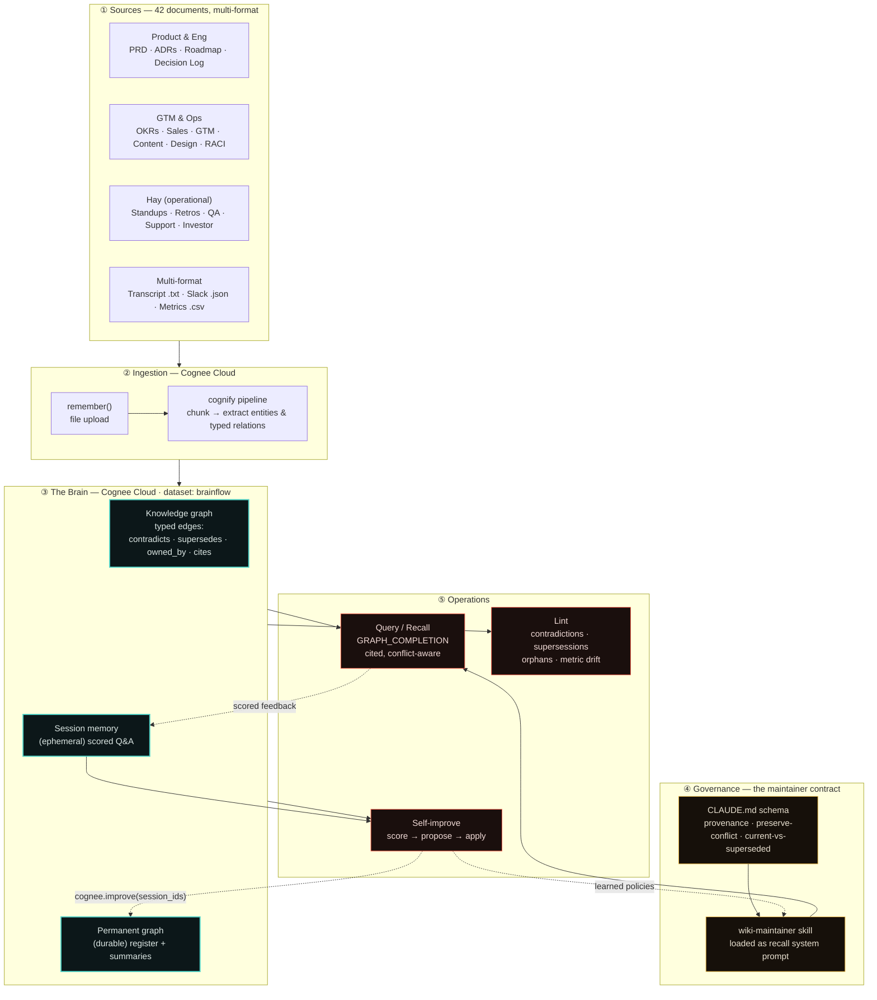
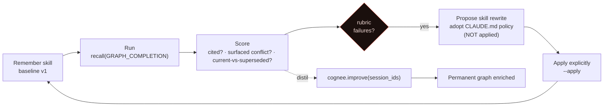

# Cognost — a self-improving, stakeholder-alignment Company Brain

> **Cognee Cloud Hackathon · 2026-06-19** · built on [Cognee](https://github.com/topoteretes/cognee) `1.2.0.dev1`

Most "chat with your docs" tools paper over disagreement — they pick one source and sound
confident. **Cognost does the opposite.** It ingests a product team's scattered documents, answers
questions **with citations while surfacing where the docs disagree**, tracks which decisions are
current vs. superseded, flags what has no owner, and **learns its own answering rules from scored
feedback.**

| Proof | Result | Evidence |
| --- | --- | --- |
| Live on Cognee Cloud, 42-doc needle-in-haystack | **8/8** stakeholder conflicts surfaced with citations | [`brainflow/snapshots/query-results.json`](brainflow/snapshots/query-results.json) |
| Decoys (competitor price · superseded ADR · unapproved draft) | **3/3** correctly *not* flagged — zero false positives | [`brainflow/snapshots/query-results.json`](brainflow/snapshots/query-results.json) |
| Self-improvement, same questions, only the *skill* changes | avg score **1.3 → 10.0 / 10** | [`brain/evidence/before-after.md`](brain/evidence/before-after.md) |
| Lint pass over the corpus | **11/11** planted misalignments caught, **reported not auto-resolved** | [`brain/evidence/lint-report.md`](brain/evidence/lint-report.md) |
| Restructured brain (live diagnostic) | open-contradiction counter ticks **0 → 6** | [▶ artifact](https://claude.ai/code/artifact/7f6b3fdf-5562-412a-a3e1-a05c46039b36) |

---

## Why it matters

Every product org has the same failure mode: the PRD says one thing, the roadmap drifted, Sales
signed a contradicting promise, and the design shipped a feature marked *"Won't have."* The truth
is **knowable but scattered** across a dozen documents by seven stakeholders. A normal RAG bot
papers over the drift. Cognost is built to **preserve the contradiction, cite both sides, and say
which version is current.**

It does three things, and a fourth that the others compound into:

1. **Answers with provenance** — every claim cites its source document and date.
2. **Surfaces disagreement** — when sources conflict it presents *both*, never guesses a winner.
3. **Lints the knowledge base** — contradictions, superseded-but-referenced decisions, metric
   drift, ownership orphans — the bookkeeping no team ever does.
4. **Improves itself** — it scores its own answers and adopts the operating rule that would have
   fixed each failure, sourced from its [`CLAUDE.md`](CLAUDE.md) contract, **proposed first and
   applied explicitly.**

---

## Architecture — two-tier memory on Cognee Cloud



| Tier | What lives here | Where |
| --- | --- | --- |
| **Session memory** (ephemeral) | raw Q&A events, scores, feedback per run | `brain/session/*.jsonl` + Cognee `session_id` |
| **Permanent graph** (durable) | entities, typed relationships, summaries, contradiction register, the wiki | Cognee graph (`cognify`) + [`wiki/`](wiki/) |

The full diagram set (system + self-improvement loop + single-query data flow) lives in
[`brainflow/ARCHITECTURE.md`](brainflow/ARCHITECTURE.md).

---

## The three operations

```bash
python brain/ingest.py --reset                # 1 INGEST  → permanent knowledge graph
python brain/query.py  --tag run              # 2 QUERY   → cited, conflict-aware answers
python brain/selfimprove.py --from-tag run    #   IMPROVE → distil feedback → graph + propose skill
python brain/lint.py                          # 3 LINT    → contradictions / supersessions / orphans
```

One-shot, end-to-end: **`bash brain/run_demo.sh`** (ingest → query *before* → self-improve →
query *after* → before/after evidence → lint).

---

## The self-improvement loop

The hackathon's skill cycle — *remember skill → run → score → record feedback (propose, don't
apply) → apply explicitly* — maps **1:1** onto Cognee 1.2's native skill API.



| Cognost (`brain/`) | Native Cognee API | What it is |
| --- | --- | --- |
| `score_answer()` → 0–10 | `SkillRunEntry.success_score` | same rubric, graph-backed run record |
| `selfimprove.propose()` | `improve_skill(…, apply=False)` → `SkillImprovementProposal` | proposal-first, **never auto-applied** |
| `selfimprove.apply()` | `improve_skill(…, apply=True)` | adopts proposal, archives the old procedure |
| `distill()` | `cognee.improve(session_ids=…)` | distils scored session → permanent graph |

The brain **learns its own operating rules from its own low-scoring answers**, sourcing each rule
from the schema rather than inventing it. Full mapping:
[`brain/SKILL_API_ALIGNMENT.md`](brain/SKILL_API_ALIGNMENT.md) · runnable reference:
[`brain/skill_native.py`](brain/skill_native.py).

---

## Before / after — same questions, only the skill changes

The only thing that differs between the columns is the **skill** (the system prompt):
`wiki-maintainer.baseline` ("be concise, give a direct answer") vs. the learned `wiki-maintainer`
(provenance · preserve-contradictions · current-vs-superseded).

| Run | Skill | Avg | Cited | Surfaced conflict | Stated currency |
| --- | --- | --- | --- | --- | --- |
| **before** | baseline v1 | **1.3 / 10** | 0/7 | 0/7 | 0/7 |
| **after** | wiki-maintainer | **10.0 / 10** | 7/7 | 7/7 | 7/7 |

> **Q — "What's the current premium-upgrade timing, and was it ever changed?"**
>
> **Before** *(1/10)* — "The premium upgrade prompt appears on Day 3 after first use." ❌ Confident
> and **wrong** — Day 3 was reverted; conflict hidden, no provenance.
>
> **After** *(10/10)* — "**Current: Day 7 after first use** (Decision Log 2026-04-09 reverted it,
> superseding the 2026-02-14 move to Day 3). Day 7 (PRD §Monetisation) → Day 3 (Decision Log
> 2026-02-14) → **back to Day 7** (Decision Log 2026-04-09). ⚠️ Stale refs still cite Day 3:
> Roadmap 2026 and Design Spec Screen 5."

Full table for all 7 questions: [`brain/evidence/before-after.md`](brain/evidence/before-after.md).

---

## Lint — the alignment money-shot

[`brain/evidence/lint-report.md`](brain/evidence/lint-report.md) catches **all 11 planted issues** —
**6 live contradictions** (AI Daily Pick scope, HR data privacy, launch platform, pricing,
exercise length, category label drift), **2 superseded-but-still-referenced** decisions (Day-3
paywall, Firebase backend), **1 metric drift** (two definitions of "40% retention"), **4 ownership
orphans**, and **2 spec-vs-design gaps**. Decisions are **reported, never auto-resolved**
([`CLAUDE.md`](CLAUDE.md) §7).

---

## Live on Cognee Cloud

Verified 2026-06-19 against the live `brainflow` brain:

- **8/8** stakeholder questions surfaced their conflict with citations and current-vs-superseded.
- **3/3** decoys correctly left alone (competitor price, superseded ADR, unapproved draft) — no
  false positives.
- The reverted **Day-3 paywall** traced across **5 documents**, including an unstructured meeting
  transcript and a Slack export.

Two-snapshot diff (same 42 sources, same graph — only the skill changes):
[`brainflow/snapshots/`](brainflow/snapshots/) → open contradictions **0 → 6**. The
[**live diagnostic artifact**](https://claude.ai/code/artifact/7f6b3fdf-5562-412a-a3e1-a05c46039b36)
animates the transition. Cloud is wired two ways — REST `remember`/`recall`, and the SDK via
[`brain/serve_cloud.py`](brain/serve_cloud.py) (`cognee.serve(url, api_key)`).

---

## The dataset — [BrainFlow](DATASET.md)

A mental-fitness app for stressed professionals (DACH market), used as synthetic team knowledge in
two corpora:

| Corpus | Size | Purpose |
| --- | --- | --- |
| [`raw/`](raw/) | **12 docs**, 11 planted misalignments | the focused, reproducible **local** pipeline |
| [`brainflow/raw/`](brainflow/raw/) | **42 docs** (12 conflict-bearing + 30 operational hay) | the **live-Cloud** needle-in-haystack at scale |

Example planted issue: the PRD marks "AI Daily Pick" as *Won't have*, while the roadmap, a later
PM decision, and the design all ship it — over a recorded Engineering objection, with no build
owner. Cognost's job is to catch exactly these. Full register: [`DATASET.md`](DATASET.md).

---

## Quickstart

```bash
cd Cognost
uv venv && source .venv/bin/activate
uv pip install -r requirements.txt
cp .env.template .env        # add your OpenAI key (local Ollama path also supported)
bash brain/run_demo.sh
```

**Cognee Cloud (bonus):** add `COGNEE_CLOUD_URL` / `COGNEE_CLOUD_API_KEY` to `.env`, then
`python brain/ingest.py --reset --push` builds locally and pushes the dataset to your Cloud
instance.

---

## Repo map

| Path | What |
| --- | --- |
| [`brain/`](brain/) | the runnable Cognee pipeline (ingest / query / self-improve / lint / evidence) — [`brain/README.md`](brain/README.md) |
| [`brain/skills/`](brain/skills/) | the active maintainer skill the pipeline runs (+ archived baseline) |
| [`my_skills/`](my_skills/) | the same skills framed onto Cognee's **native** skill API (`SkillRunEntry`, `improve_skill`) |
| [`wiki/`](wiki/) | the human-readable wiki: overview, contradiction register, topic & source pages |
| [`raw/`](raw/) | the 12-doc focused source corpus |
| [`brainflow/`](brainflow/) | the 42-doc live-Cloud corpus, architecture diagrams, snapshots, and diagnostic |
| [`CLAUDE.md`](CLAUDE.md) | the maintainer contract — provenance, never silently resolve a contradiction, current-vs-superseded |
| [`SUBMISSION.md`](SUBMISSION.md) | the full hackathon write-up and pitch |
| [`DATASET.md`](DATASET.md) | the synthetic dataset and its planted issues |

---

## Stack

Cognee `1.2.0.dev1` · OpenAI by default (local Ollama + `nomic-embed-text` path included,
no cloud key required to run) · Cognee Cloud for the live suite · Python 3.12.

**Repo:** https://github.com/kaiser-data/cognost
