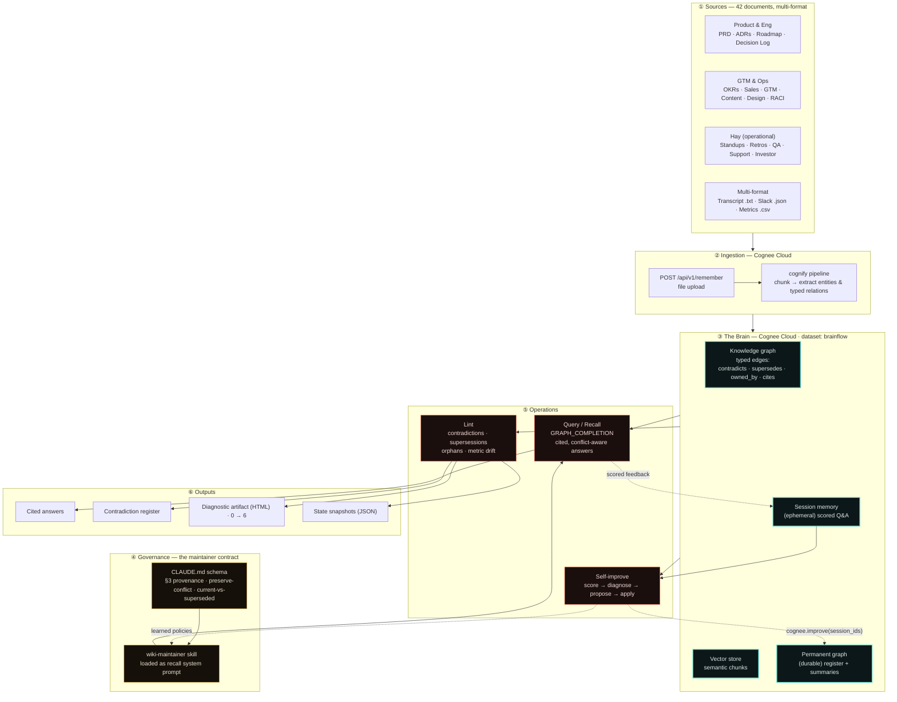
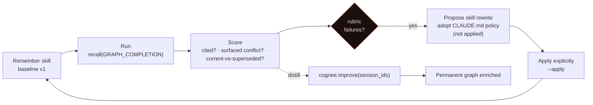

# Cognost — Architecture

**A self-improving, stakeholder-alignment Company Brain on Cognee Cloud.**

Cognost ingests a product team's scattered documents into one knowledge graph, then answers
questions **with citations while surfacing where the documents disagree** — tracking which
decisions are current vs. superseded, flagging what has no owner, and **improving its own
answering behaviour from scored feedback**.

The reference corpus is **BrainFlow**: 42 documents (12 conflict-bearing + 30 realistic
operational docs) with 11 planted misalignments hiding in the noise — a needle-in-a-haystack test.

---

## System architecture

---

## Components

| # | Component | Responsibility | Implementation |
|---|---|---|---|
| ① | **Sources** | The raw, immutable team knowledge — never edited | 42 docs in `raw/` (md/txt/json/csv) |
| ② | **Ingestion** | Turn documents into graph + vectors | `/api/v1/remember` → Cognee `cognify` |
| ③ | **The Brain** | Persist entities + typed relationships and embeddings; two-tier memory | Cognee Cloud dataset `brainflow` |
| ④ | **Governance** | The contract that makes the brain a disciplined maintainer, not a chatbot | `CLAUDE.md` schema → `wiki-maintainer` skill |
| ⑤ | **Operations** | Query, lint, and self-improve | `/api/v1/recall`, lint pass, self-improve loop |
| ⑥ | **Outputs** | What stakeholders consume | Answers, register, the diagnostic artifact, JSON snapshots |

### Two-tier memory (③)

| Tier | Holds | Lifetime |
|---|---|---|
| **Session memory** | raw scored Q&A events, feedback per run | ephemeral (per `session_id`) |
| **Permanent graph** | entities, typed edges, summaries, contradiction register | durable |

**Self-improvement = distilling scored session feedback into the permanent graph.**

---

## The self-improvement loop (⑤·O3)

The brain literally **learns its own operating rules from its mistakes**, sourcing each new rule
from the `CLAUDE.md` schema rather than inventing it. Proposals are written but **never applied
silently** — adoption is an explicit step.

---

## Data flow — a single query

1. `recall(query, GRAPH_COMPLETION, session_id)` runs against the `brainflow` graph, with the
   `wiki-maintainer` skill as the system prompt.
2. The graph traverses **typed edges** (`contradicts`, `supersedes`, `owned_by`) — not just
   nearest-neighbour chunks — so it can present *both* sides of a disagreement.
3. The answer cites every claim, names the current value, and what it superseded.
4. The interaction is written to **session memory**; a useful synthesis can be filed back into
   the **permanent graph** so explorations compound.

---

## Verification (live, 2026-06-19)

Run against the live `brainflow` brain on Cognee Cloud:

- **8/8** stakeholder questions surfaced their conflict with citations + current-vs-superseded.
- **3/3** decoys correctly *not* flagged (competitor price, superseded ADR, unapproved draft) — no false positives.
- The reverted **Day-3 paywall** was traced across 5 documents (roadmap, design, QA plan, decision log, meeting transcript).

See `snapshots/query-results.json` and `brain-diagnostic.html` for the evidence.

---

## Tech stack

- **Cognee Cloud** — managed knowledge-graph + vector memory (`remember` / `recall` / `improve`).
- **Graph operations** — `GRAPH_COMPLETION` recall over typed relationships.
- **Governance** — `CLAUDE.md` maintainer schema; versioned `wiki-maintainer` skill.
- **Presentation** — self-contained HTML diagnostic (Canvas graph viz, no external deps).
